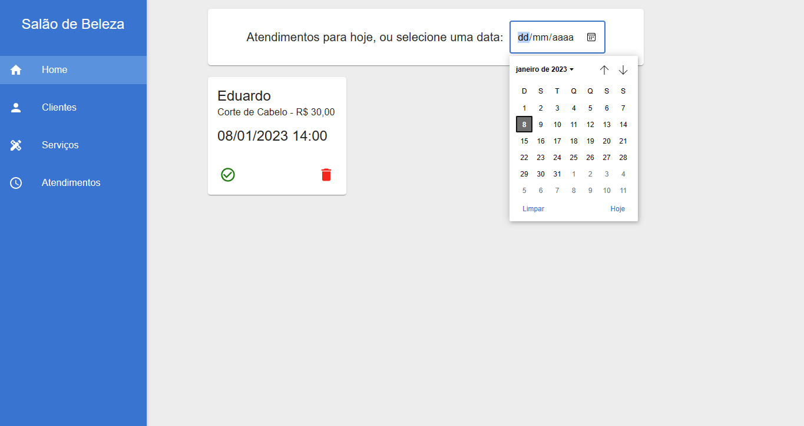

# Projeto Integrador II




> Projeto fullstack para o controle de clientes, serviços e atendimentos de um salão de beleza.

### Ajustes e melhorias

O projeto ainda está em desenvolvimento e as próximas atualizações serão voltadas nas seguintes tarefas:

- [x] Adicionar hooks
- [x] Refatorar os forms
- [x] Diminuir as renderizações

## 💻 Pré-requisitos

Antes de começar, verifique se você atendeu aos seguintes requisitos:

- Você instalou a versão mais recente do `Node.js`.

## 🚀 Instalando o projeto-integrador-ii

Para instalar o projeto-integrador-ii, siga estas etapas:

1. Clone este repositório em sua máquina.

2. Abra um terminal para cada pasta do projeto (backend e frontend) e execute o seguinte comando:

```
npm install
```

## ☕ Usando o projeto-integrador-ii

Para usar o projeto-integrador-ii, siga estas etapas:

1. Configure as variáveis de ambiente do backend. (são dados de conexão do MongoDB, crie um banco de dados de teste e adicione as informações da string de conexão em um `.env` como no `.env.example`)

2. Abra o terminal na pasta backend, e digite o seguinte comando:

```
npm run dev
```

3. Abra o terminal na pasta frontend, e digite o seguinte comando:

```
npm start
```

## 📝 Licença

Esse projeto está sob licença. Veja o arquivo [LICENÇA](LICENSE.md) para mais detalhes.
